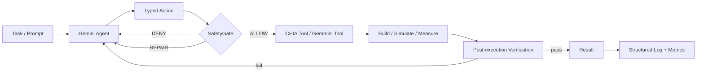

# CHIA Work — SafeAgent for Agentic HW/SW Co-Design

Private working repository for the A³ CHIA Hackathon 2026.

> Current phase (2026-09-18): recovery sprint before the funded compute window. The repository is scaffolded for a typed-action safety layer, structured experiment logging, CHIA integration, GCP migration, and the final 4-page submission.

## Research thesis

Agentic HW/SW co-design becomes risky when an LLM can directly invoke build, simulation, configuration, and shell-like tools. This project evaluates whether a lightweight `SafetyGate` around typed actions can prevent unsafe or invalid tool calls while preserving task success and enabling recovery.

## Target loop



## Internal milestones

| Date | Gate | Required output |
|---|---|---|
| Sep 18 | Gate A | One end-to-end local/dry-run path and the real integration points identified |
| Sep 19 | Experiment freeze | U0/S1/S2/S3/S4 matrix, metrics, fault cases |
| Sep 20 | Gate B | Reproducible setup, GCP credential swap ready, paper skeleton mostly written |
| Sep 21 | Compute day 1 | Migration smoke test + baseline runs |
| Sep 22 | Compute day 2 | Main SafeAgent runs + repetitions |
| Sep 23 | Compute day 3 | Missing cells, ablations, reruns |
| Sep 24 AoE | Submission | 4-page PDF + open-source release + results + HotCRP |

## Start here

```bash
# 1) Read project control-plane
cat CURRENT-PLAN.md
cat CHECKPOINT.md
cat PACKAGE-STATUS.md

# 2) Local scaffold smoke test (does NOT require CHIA/GCP)
python scripts/smoke_test.py

# 3) Run the synthetic experiment harness
python scripts/run_experiments.py --config configs/experiment.example.json

# 4) Bootstrap official CHIA once Python 3.10.19 is available
bash scripts/bootstrap_chia.sh
```

Dry-run outputs are explicitly marked `mocked=true` and **must never be used as paper results**.

## Repository map

```text
.
├── AGENTS.md                    # rules for ChatGPT/Codex/other assistants
├── CURRENT-PLAN.md              # current execution plan
├── CHECKPOINT.md                # exact current state / next gate
├── PACKAGE-STATUS.md            # file-by-file readiness
├── configs/                     # experiment definitions; no secrets
├── docs/
│   ├── architecture/            # SafeAgent design
│   ├── experiments/             # matrix + metrics
│   ├── gcp/                     # funded-account migration runbook
│   ├── hackathon/               # official requirements snapshot
│   ├── integration/             # CHIA/Gemmini integration plan
│   └── submission/              # HotCRP/release checklist
├── paper/                       # 4-page paper outline
├── scripts/                     # bootstrap, smoke, experiment entrypoints
├── src/chia_work/               # typed actions, safety, logging, runner, adapters
├── tests/                       # unit tests for local safety logic
├── logs/                        # generated logs (ignored except .gitkeep)
└── results/                     # generated results (ignored except .gitkeep)
```

## Official references

- CHIA: https://github.com/ucb-bar/chia
- CHIA docs: https://docs.chialoops.ai/
- Hackathon: https://agentic-arch.org/hackathon.html
- HotCRP: https://a3-chia-hackathon-26.hotcrp.com/

The official CHIA repository currently documents Python 3.10.19 for the supplied environment. The final hackathon artifact must be released publicly; this working repository is private for now and must be made public (or released to a public repository) before final submission.
