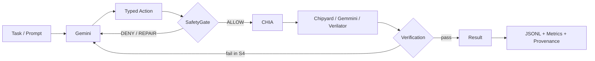

# CHIA Work — SafeAgent for Agentic HW/SW Co-Design

Private working repository for the A³ CHIA Hackathon 2026.

> **Current phase — Sep 18:** the real CHIA/Gemmini paths and U0–S4 experiment harness are implemented. Gate A remains open until successful `mocked=false` execution artifacts are captured.

## Research thesis

Agentic HW/SW co-design becomes risky when an LLM can directly invoke build, simulation, configuration, and shell-like tools. This project evaluates whether a lightweight SafeAgent layer—schema-constrained typed actions, pre-execution policy, post-execution verification, and bounded feedback repair—can prevent unsafe/invalid actions while preserving hardware-task success.

## Target loop



## Exact ablations

| Variant | Generic pre-check | Semantic typed policy | Post-verification used by system | Repair/retry |
|---|---:|---:|---:|---:|
| U0 | No | No | No | No |
| S1 | Yes | No | No | No |
| S2 | Yes | Yes | No | No |
| S3 | Yes | Yes | Yes | No |
| S4 | Yes | Yes | Yes | Yes |

Source of truth: `src/chia_work/variants.py`.

## Hardware workloads

### H1 — primary accelerator workload

`mvin_mvout` from upstream Gemmini RoCC tests executes real Gemmini `mvin`/`mvout` operations, moving matrices through the accelerator scratchpad and comparing the result against the input. The upstream program exits non-zero on mismatch, so simulator exit code 0 is the objective pass oracle.

Implementation: `src/chia_work/gemmini_mvin_mvout.py`.

### H0 — bring-up only

A small bare-metal marker program validates CHIA → build → compile → Verilator plumbing. It does **not** exercise Gemmini instructions and is not a primary paper workload.

Implementation: `src/chia_work/gemmini_sanity.py`.

## Start here

```bash
# Control plane
cat CURRENT-PLAN.md
cat CHECKPOINT.md
cat PACKAGE-STATUS.md

# Local logic checks: no CHIA/GCP required
make test
make smoke
make safety-challenges

# Install the pinned CHIA source with Python 3.10.19
bash scripts/bootstrap_chia.sh

# Gate A.1 — real CHIA/Ray round trip
make real-chia

# Configure Gemini: funded GCP/ADC preferred; see .env.example
# Export the populated environment variables before the agent tests.
make real-agent

# Start a single-host CHIA hardware cluster: Linux + Docker + SSH-to-self required
export THIS_MACHINE=$(hostname -I | awk '{print $1}')
export CHIA_WORK_DIR=$(pwd)
export USER=$(id -un)
make gemmini-up

# Capture actual source/package/Docker provenance
make capture-env

# Isolated hardware bring-up
make real-gemmini
make real-gemmini-sanity

# Primary accelerator workload
make real-gemmini-mvin-mvout
make real-agent-gemmini-mvin-mvout

# U0–S4 pilot; first build is a warm-up excluded from comparative timing
make hardware-pilot

# Tear down when finished
make gemmini-down
```

## Evidence rules

- Dry-run rows are always `mocked=true` and may never populate paper results.
- Counterfactual safety challenge rows have `executed=false`; unsafe U0 actions are never actually launched.
- Real hardware evidence must have `mocked=false`.
- H1 success requires the upstream self-checking `mvin_mvout` workload to return exit code 0.
- `scripts/summarize_results.py` rejects mocked rows by default.
- Gate A stays open until real execution artifacts exist; implementation alone is not a pass.

## Key files

```text
CURRENT-PLAN.md                         sprint/deadline source of truth
CHECKPOINT.md                           exact current gate
PACKAGE-STATUS.md                       readiness by area
configs/chia-gemmini-local.yaml         chipyard + riscv_build + verilator workers
configs/safety-challenges.json          non-executing safety suite
configs/hardware-pilot.json             real U0–S4 H1 pilot
src/chia_work/gemini_agent.py           schema-constrained Gemini proposals
src/chia_work/safety.py                 S1/S2+ policies
src/chia_work/agentic_loop.py           S4 feedback/retry
src/chia_work/gemmini_mvin_mvout.py     primary real accelerator executor
scripts/capture_environment.py          source/package/image provenance
scripts/run_real_hardware_pilot.py      cached U0–S4 real pilot
paper/outline.md                         4-page paper scaffold
```

## Internal milestones

| Date | Required state |
|---|---|
| Sep 18 | Capture first real CHIA, H1, and agentic-H1 evidence |
| Sep 19 | Run pilot; freeze variants, safety/recovery tasks, metrics, repetition plan |
| Sep 20 | Clean-room reproduction, GCP swap rehearsal, paper sections 1–6, HotCRP registration |
| Sep 21–23 | Funded compute batches and reruns |
| Sep 24 AoE | 4-page PDF + public artifact/results + HotCRP submission |

## Official references

- CHIA: https://github.com/ucb-bar/chia
- CHIA docs: https://docs.chialoops.ai/
- Hackathon: https://agentic-arch.org/hackathon.html
- HotCRP: https://a3-chia-hackathon-26.hotcrp.com/

The working repository is private during development. The final artifact must be released publicly before submission. Never commit GCP/Gemini credentials or service-account material.
