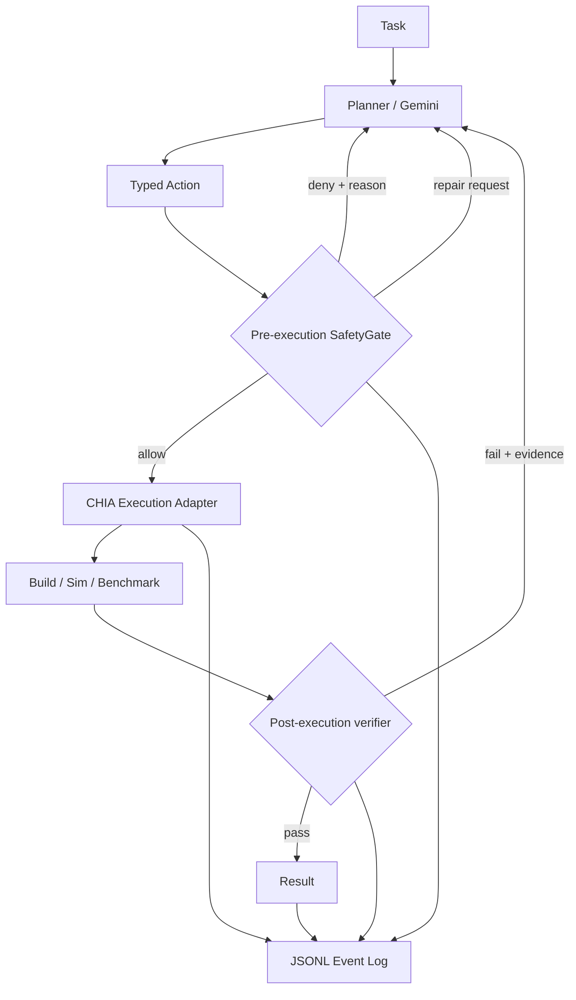

# SafeAgent architecture

## Research question

Can a structured safety layer around agent-generated hardware/software co-design actions reduce unsafe/invalid tool execution without destroying task success, and can post-execution verification improve recovery after failures?

## Failure model

This project studies engineering failures relevant to agentic co-design rather than claiming a complete security model.

Target failure classes:

1. malformed tool arguments;
2. destructive or over-broad shell actions;
3. invalid configuration mutation;
4. action outside an allowed workspace/resource scope;
5. build/simulation failure ignored by the agent;
6. result accepted without checking expected artifacts/metrics;
7. retry loops with no explicit cap.

## Architecture

## Typed actions

Instead of giving the agent an unrestricted shell by default, actions are represented explicitly, e.g.:

- `BUILD`
- `SIMULATE`
- `MODIFY_CONFIG`
- `RUN_BENCHMARK`
- `SHELL` (denied by default in the local SafetyGate)

Typed actions make validation and ablation possible. They do not themselves guarantee safety.

## Pre-execution gate

The initial local gate validates:

- action type;
- required fields;
- coarse command/path policy;
- denylisted destructive patterns;
- optional repairable omissions.

The real CHIA integration must map approved actions to narrow tool APIs rather than re-expanding everything into arbitrary shell strings.

## Post-execution verification

Verification should examine machine-readable evidence where possible:

- process exit code;
- expected output artifact exists;
- benchmark output parses;
- metric range is plausible;
- tool produced the requested configuration/result;
- retry cap has not been exceeded.

## Non-goal

`SafetyGate` is an experimental policy component for the paper. It is **not** a production sandbox, malware defense, or formal security boundary.
